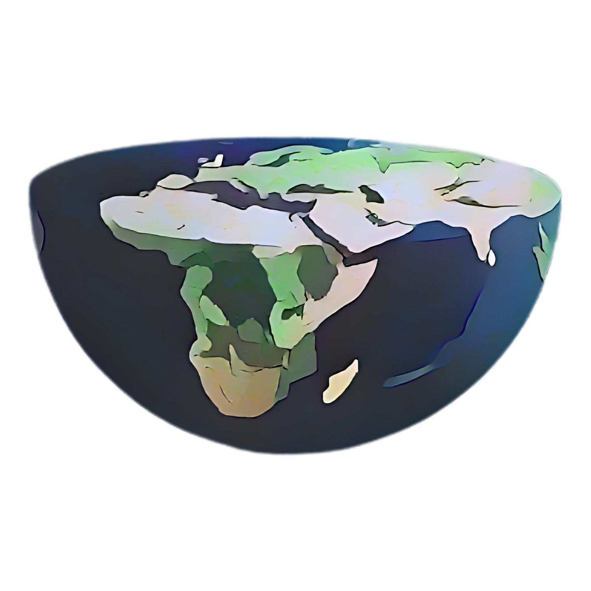
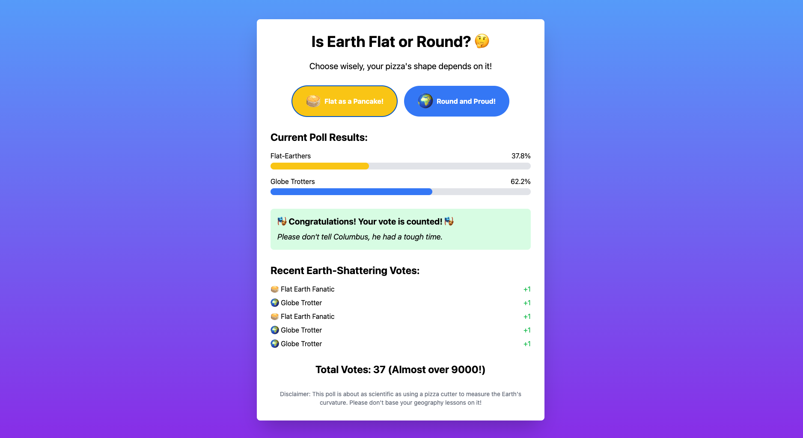

<a id="readme-top"></a>

<br />
<div align="center">
  <a href="https://github.com/colt005/flatornot">
    
  </a>

  <h3 align="center">Is Earth Flat or Round? The Ultimate Showdown!</h3>

  <p align="center">
    A website where people can vote if the earth is flat or not!
    <br />
    <br />
    <a href="https://flatornot.xyz">View Website</a>
    ·
    <a href="https://github.com/colt005/flatornot/issues/new?labels=bug">Report Bug</a>
    ·
    <a href="https://github.com/colt005/flatornot/issues/new?labels=enhancement">Request Feature</a>
  </p>
</div>


# About The Project

 <a href="https://flatornot.xyz">
    
</a>


## FlatOrNot - The Great Debate

## Introduction

Welcome to **FlatOrNot**, the ultimate battleground for one of humanity's most profound debates: is the Earth flat or round? Yeah, you read that right. One day, while casually browsing the depths of the internet (as one does), I stumbled across an article that blew my mind. Apparently, there are _actual_ people who think the Earth is flat. Yup, flat—like a pancake. Naturally, I was like, “Wait, what? This can't be real.” But oh, it’s real, folks.

So, after reading way more about this flat Earth theory than I care to admit, I decided it was time to take action. No, not by launching a space mission to see the curve for myself (though that would be awesome), but by creating this website where people can cast their votes and settle this once and for all.

## The Mission

The mission of **FlatOrNot** is simple:

- Is the Earth flat?
- Is it round?

That’s it. Two options. Vote your heart out and let’s see where you land (pun intended).

## How It Works

You head over to the site, you take a deep breath, and then you make your choice. Flat? Round? Maybe you’re unsure and want to see how others have voted first. Whatever your stance is, this is your chance to let the world know your thoughts (no space travel required).

## Why Did I Make This?

Well, apart from being slightly obsessed with quirky internet topics, I figured this could be a fun way to engage with the age-old “debate” that somehow still exists. Plus, it's hilarious to see the vote split. We’re here for a good time, folks.

Also, I love exploring new stuff, and this project gave me the perfect excuse to try my hands on **Server-Sent Events (SSE)**. Yeah, that's right—real-time updates. I wanted to keep things dynamic and exciting, because what's better than watching live votes roll in while people decide if we're living on a giant pizza or a big, blue marble?


<p align="right">(<a href="#readme-top">back to top</a>)</p>


## Getting Started


### Prerequisites

* go

### How to run

1. Clone the repo
    ```sh
   git clone https://github.com/colt005/flatornot.git
   ```
2. Set the following envs
    - LISTEN_ADDR - PORT that you want the server to run on
    - Database variables - self explanatory
        - DB_HOST
        - DB_USER
        - DB_PASS
        - DB_NAME
        - DB_PORT
3. RUN!
    ```sh
    go run main.go
    ```

### Using Docker

1. To start
  ```sh
  docker-compose up -d
  ```
2. To stop
  ```sh
  docker-compose down -v
  ```


<p align="right">(<a href="#readme-top">back to top</a>)</p>


<!-- ROADMAP -->
## Roadmap

- [X] Add sessionID for each unique browser session
- [X] Store these sessionIDs locally for reuse
- [ ] Sync the votes with DB


See the [open issues](https://github.com/colt005/flatornot/issues) for a full list of proposed features (and known issues).

<p align="right">(<a href="#readme-top">back to top</a>)</p>


<!-- CONTRIBUTING -->
## Contributing

Contributions are what make the open source community such an amazing place to learn, inspire, and create. Any contributions you make are **greatly appreciated**.

If you have a suggestion that would make this better, please fork the repo and create a pull request. You can also simply open an issue with the tag "enhancement". Make sure your commit has an emoji in it LOL
Don't forget to give the project a star! Thanks again!

1. Fork the Project
2. Create your Feature Branch (`git checkout -b feature/AmazingFeature`)
3. Commit your Changes (`git commit -m '✨ Add some AmazingFeature'`)
4. Push to the Branch (`git push origin feature/AmazingFeature`)
5. Open a Pull Request

<!-- LICENSE -->
## License

Distributed under the GNU GENERAL PUBLIC LICENSE. See [LICENSE](https://github.com/colt005/flatornot/LICENSE) for more information.

<p align="right">(<a href="#readme-top">back to top</a>)</p>


